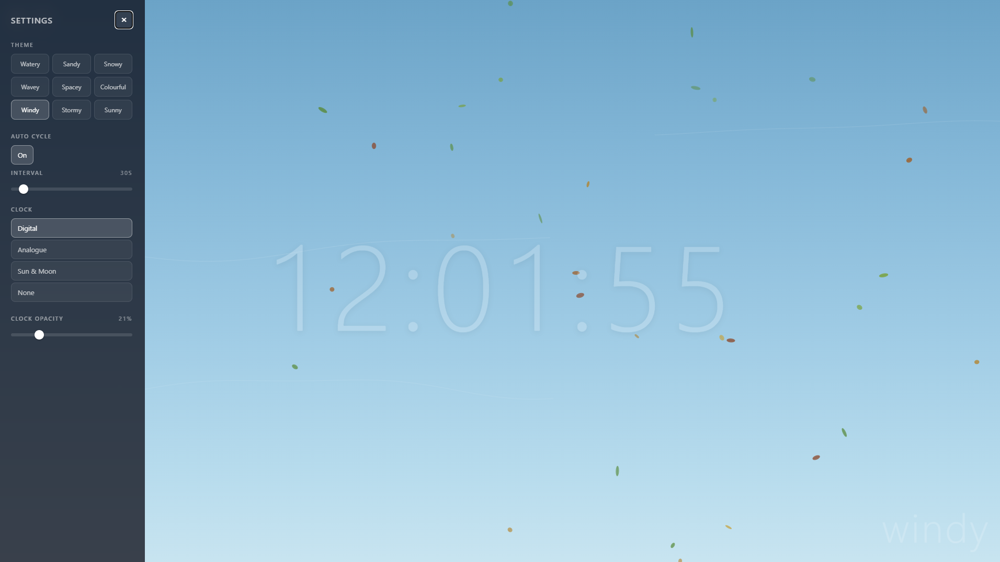

# Calm Visualiser

A relaxing, full-screen ambient visualiser built as a single HTML file with no dependencies. Features 9 animated particle themes, multiple clock styles, and smooth cross-fade transitions.

## Features

- **9 Animated Themes** — Watery, Sandy, Snowy, Wavey, Spacey, Colourful, Windy, Stormy, and Sunny
- **Auto Cycle** — Automatically rotate through all themes on a configurable timer (10s–5min)
- **3 Clock Styles** — Digital, Analogue, and Sun & Moon, or hide the clock entirely
- **Adjustable Clock Opacity** — Slider to blend the clock into the background
- **Fullscreen Mode** — Immersive viewing with a single click or press `F`
- **Smooth Transitions** — Cross-fade effect when switching between themes
- **Persistent Settings** — Theme, clock, opacity, and auto-cycle preferences saved to localStorage
- **Zero Dependencies** — Everything runs from a single `index.html` file

## Usage

Open `index.html` in any modern browser. That's it.

### Controls

| Action | How |
|---|---|
| Open settings | Click the gear icon (top-left) |
| Toggle fullscreen | Click the fullscreen button or press **F** |
| Close settings | Click **×** or press **Escape** |
| Switch theme | Click a theme in the settings panel |
| Auto cycle themes | Toggle "Auto Cycle" on in settings and adjust the interval |

### Keyboard Shortcuts

- **F** — Toggle fullscreen
- **Escape** — Close settings panel

## Browser Support

Works in all modern browsers (Chrome, Firefox, Edge, Safari). Uses the Canvas API for rendering and `localStorage` for preferences.

## Licence

This project is provided as-is for personal use and experimentation.
